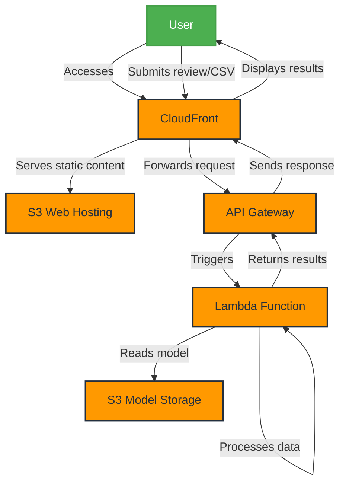

# AWS Design, Planning, and Cost Report - Sentiment Analysis Project

## 1. Architecture Overview

### 1.1 Architecture Diagram

### 1.2 Components

1. **S3 Buckets**
   - Model Storage: For storing the TensorFlow model
   - Web Hosting: For hosting the static website files

2. **Lambda Function**
   - Sentiment Analysis Processing: Handles both individual reviews and CSV files

3. **API Gateway**
   - RESTful API: Exposes the Lambda function

4. **CloudFront**
   - Content Delivery Network: Serves the web application

### 1.3 Data Flow

1. User accesses the web application via CloudFront
2. User submits a review or CSV file through the web interface
3. Request is sent to API Gateway
4. API Gateway triggers the Lambda function
5. Lambda function processes the input:
   - Downloads model from S3 (if not cached)
   - Performs sentiment analysis
   - Returns results
6. Results are displayed to the user through the web interface

## 2. Implementation Plan

The implementation of this project will be divided into several phases. The order of these phases is designed to build the system incrementally, allowing for testing and validation at each stage.

### 2.1 Phase 1: Backend Setup

1. Create S3 bucket for model storage
2. Upload TensorFlow model to S3
3. Develop Lambda function for sentiment analysis
4. Set up API Gateway and create necessary endpoints
5. Test backend functionality

### 2.2 Phase 2: Frontend Development

1. Design and develop the web application
2. Create S3 bucket for web hosting
3. Upload web files to S3
4. Set up CloudFront distribution
5. Configure CloudFront to use S3 as origin

### 2.3 Phase 3: Integration and Testing

1. Integrate frontend with API Gateway
2. Conduct end-to-end testing
3. Optimize performance
4. Implement monitoring and logging

### 2.4 Phase 4: Security and Compliance

1. Review and enhance security measures
2. Ensure compliance with relevant standards
3. Implement encryption for data in transit and at rest

### 2.5 Phase 5: Documentation and Deployment

1. Prepare user and technical documentation
2. Develop deployment scripts
3. Perform final testing
4. Deploy to production

Note: The actual duration of each phase will depend on various factors including team size, expertise, and potential challenges encountered during implementation. It's recommended to use project management tools and methodologies to create a more detailed timeline as the project progresses.

## 3. Cost Estimation

### 3.1 Usage-Based Cost Breakdown

#### Lambda Function
- Cost per 1 million invocations: $0.20
- Compute cost: $0.0000166667 per GB-second
- Assumption: 1024 MB memory, average 500ms execution time
- Cost per 1 million reviews: $0.20 + (1024 * 0.0000166667 * 0.5 * 1,000,000 / 1024) = $4.35

#### API Gateway
- Cost per 1 million API calls: $3.50

#### S3
- Storage: $0.023 per GB per month
- PUT/COPY/POST/LIST requests: $0.005 per 1,000 requests
- GET/SELECT requests: $0.0004 per 1,000 requests

#### CloudFront
- Data transfer out to internet: $0.085 per GB for the first 10 TB
- HTTPS requests: $0.0075 per 10,000 requests

### 3.2 Sample Scenarios

1. **Small Scale (10,000 reviews/month)**
   - Lambda: 10,000 * $4.35 / 1,000,000 = $0.0435
   - API Gateway: 10,000 * $3.50 / 1,000,000 = $0.035
   - S3 (assuming 1 MB per 1,000 reviews): 
     - Storage: 0.01 GB * $0.023 = $0.00023
     - Requests: Negligible
   - CloudFront (assuming 100 KB per review):
     - Data transfer: 1 GB * $0.085 = $0.085
     - Requests: 10,000 * $0.0075 / 10,000 = $0.0075
   Total: $0.17108 per month

2. **Medium Scale (1 million reviews/month)**
   - Lambda: $4.35
   - API Gateway: $3.50
   - S3 (assuming 1 MB per 1,000 reviews):
     - Storage: 1 GB * $0.023 = $0.023
     - Requests: 1,000 * $0.005 = $0.005
   - CloudFront (assuming 100 KB per review):
     - Data transfer: 100 GB * $0.085 = $8.50
     - Requests: 1,000,000 * $0.0075 / 10,000 = $0.75
   Total: $17.128 per month

3. **Large Scale (100 million reviews/month)**
   - Lambda: $435
   - API Gateway: $350
   - S3 (assuming 1 MB per 1,000 reviews):
     - Storage: 100 GB * $0.023 = $2.30
     - Requests: 100,000 * $0.005 = $0.50
   - CloudFront (assuming 100 KB per review):
     - Data transfer: 10 TB * $0.085 = $850
     - Requests: 100,000,000 * $0.0075 / 10,000 = $75
   Total: $1,712.80 per month

### 3.3 CSV File Processing
- Additional S3 costs for CSV storage: $0.023 per GB per month
- S3 GET requests for CSV files: $0.0004 per 1,000 requests
- Lambda execution time may increase for larger files

Example: Processing a 100 MB CSV file
- S3 storage (assuming 1-month retention): 0.1 GB * $0.023 = $0.0023
- S3 GET request: Negligible
- Additional Lambda cost (assuming 2x normal execution time):
  - 100 MB file ≈ 100,000 reviews
  - Extra cost: 100,000 * $4.35 / 1,000,000 = $0.435
Total additional cost for 100 MB CSV: $0.4373

### 3.4 Additional Considerations
- Costs may vary based on actual usage patterns and data transfer
- Consider using AWS Cost Explorer and setting up billing alarms to monitor and optimize costs
- Reserved Capacity for Lambda or Savings Plans can reduce costs for consistent, long-term usage
- Implement auto-scaling and usage quotas to prevent unexpected cost spikes

## 4. Scaling Considerations

- Lambda: Auto-scales based on incoming requests
- S3: Virtually unlimited scaling, cost increases with storage and requests
- API Gateway: Can handle very high throughput, may need to request limit increases for extremely high volume
- CloudFront: Globally distributed, automatically scales

## 5. Monitoring and Maintenance Plan

1. Set up CloudWatch alarms for:
   - Lambda errors and duration
   - API Gateway 4xx and 5xx errors
   - S3 bucket size and request count

2. Implement logging:
   - Lambda function logs to CloudWatch Logs
   - S3 access logs
   - CloudFront access logs

3. Regular maintenance tasks:
   - Review and analyze logs weekly
   - Update dependencies monthly
   - Conduct security audits quarterly

## 6. Risks and Mitigation Strategies

1. **Cold Start Latency**
   - Risk: Initial Lambda invocations may be slow
   - Mitigation: Implement provisioned concurrency for critical functions

2. **Data Privacy**
   - Risk: Handling potentially sensitive review data
   - Mitigation: Implement encryption at rest and in transit, regular security audits

3. **Cost Overruns**
   - Risk: Unexpected spikes in usage leading to high costs
   - Mitigation: Set up billing alarms, implement usage quotas

4. **Service Disruptions**
   - Risk: AWS service outages
   - Mitigation: Design for multi-region failover for critical components

## 7. Future Enhancements

1. Implement A/B testing for model updates
2. Explore AWS SageMaker for model hosting and training
3. Develop a CI/CD pipeline for automated deployments
4. Implement user authentication and personalized dashboards
5. Integrate with other AWS services (e.g., Comprehend) for enhanced text analysis
